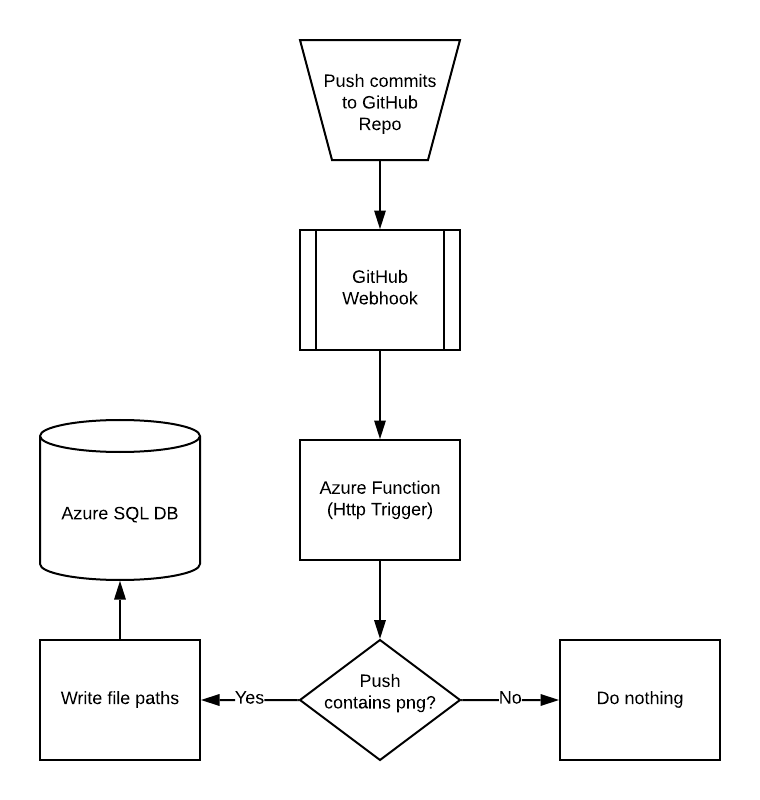

# Secret Santa

Azure function that is triggered by a GitHub webhook. Writes png names to an Azure SQL Database. Solution utilizes best azure function async practices and has a unit test included. The unit test passes all given tests but then fails with a timeout error -- not sure why, but probably has to do with the `runStub` call.

See this diagram for how the system all works:
